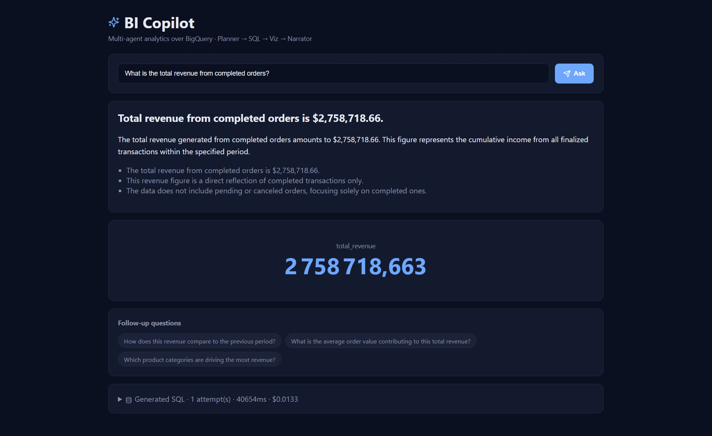
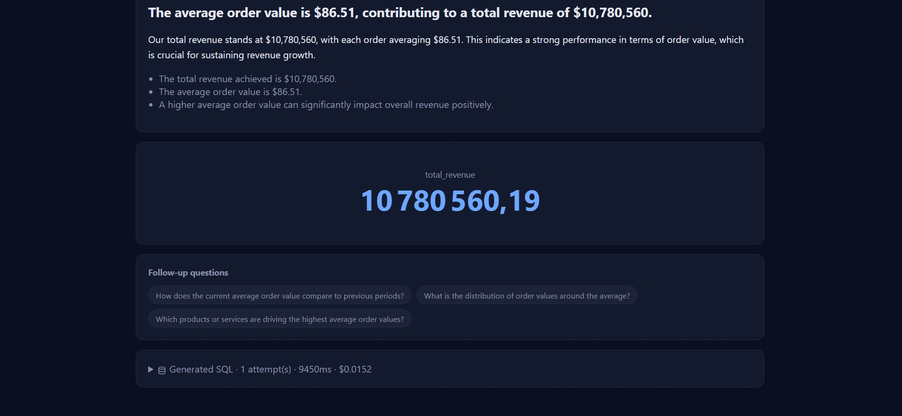
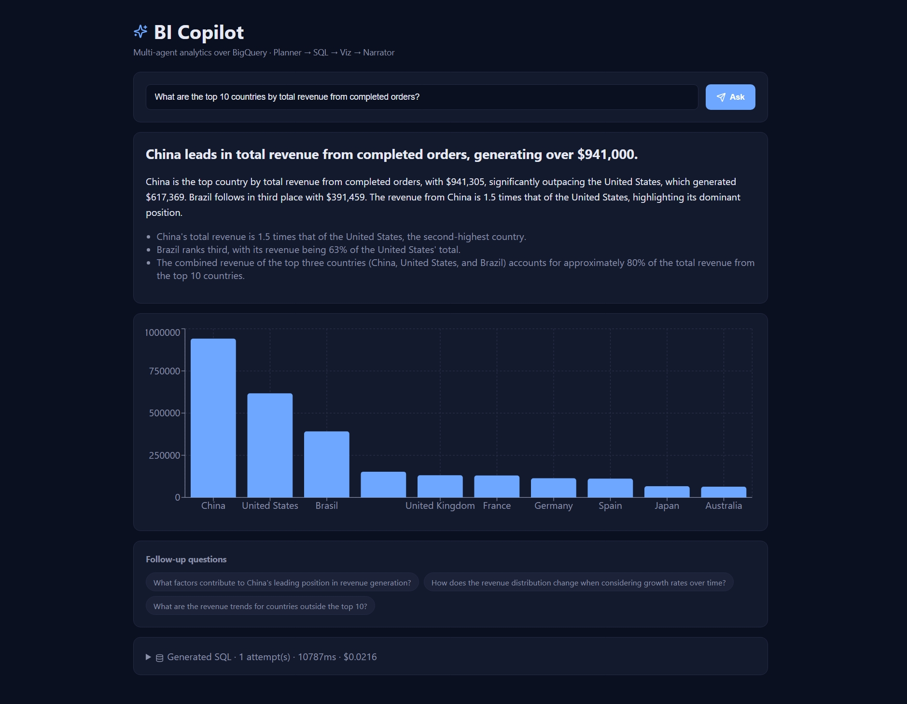
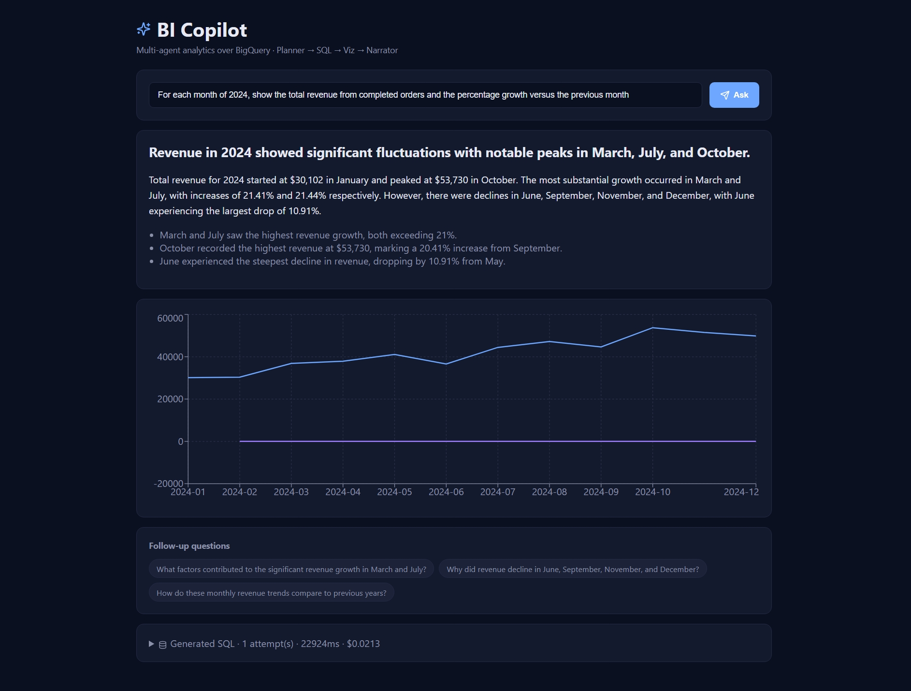
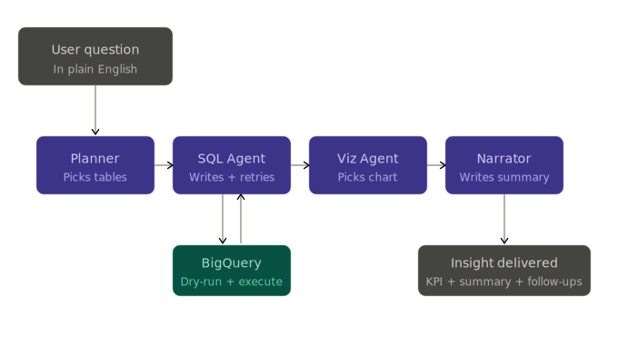
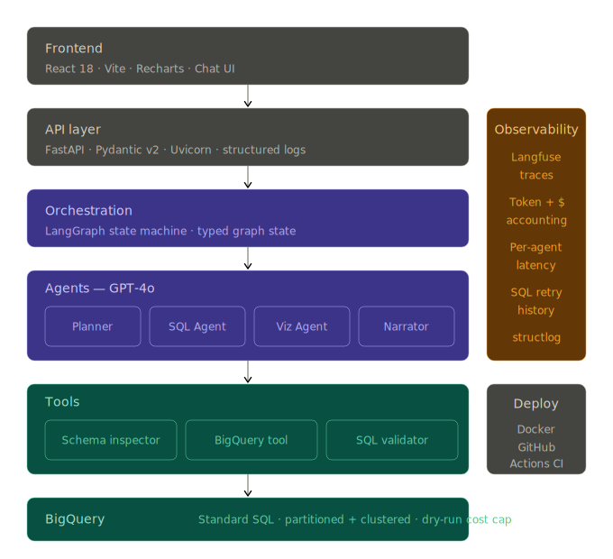

<div align="center">


#  BI Copilot

### Multi-Agent Conversational Analytics over BigQuery

##### *Planner → SQL Agent → Viz Agent → Narrator · LangGraph + GPT-4o · Production-grade Python + React*

</div>

---

## What it does

Non-technical users ask a business question in plain English. The system queries the data warehouse, picks the right chart type, renders it in the frontend, and writes a C-level executive summary — all in one round-trip.

> *"What is the total revenue from completed orders?"*

Returns **$2,758,718.66**, a KPI tile, three insights, and three follow-up questions, in roughly 10 seconds (warm cache).

### Demo gallery — four question types, four auto-chosen renderings

The Viz Agent inspects the shape of the data returned by BigQuery and decides — for each question — whether to render a KPI tile, a bar chart, a line chart, or a table. No frontend rules, no chart picker in the UI. The agent decides; the React frontend renders the Vega-Lite-style spec it receives.

#### 1. Scalar question → KPI tile

<div align="center">
  
  <br/>
  <em>Question: total revenue from completed orders → 1×1 result → KPI tile · 35 s cold start · $0.0133 · 1 SQL attempt.</em>
</div>

<br/>

#### 2. Follow-up question → another KPI

<div align="center">
  
  <br/>
  <em>Follow-up clicked from the previous answer · 9.4 s warm-cache latency · $0.0152.</em>
</div>

<br/>

#### 3. Top-N comparison → auto bar chart

<div align="center">
  
  <br/>
  <em>"Top 10 countries by total revenue from completed orders" → 10 categorical rows → bar chart picked automatically · 4-table JOIN generated first-try in 10.8 s.</em>
</div>

<br/>

#### 4. Temporal trend → auto line chart with growth overlay

<div align="center">
  
  <br/>
  <em>"For each month of 2024, show total revenue and month-over-month growth %" → 12 temporal rows with two metrics → line chart picked automatically · CTE + LAG() window function generated in 22.9 s, first attempt.</em>
</div>

What makes the interactive frontend impressive is **what isn't there**: no chart-type dropdown, no field picker, no manual configuration. The user types a question; the system decides the right way to show the answer and renders it inline. The SQL is collapsed by default but expandable for analysts who want to verify the query that produced the number.

---

## Architecture

### Functional view — what happens when a user asks a question

<div align="center">
  
</div>

The four agents are specialised, not interchangeable. Each one has a focused prompt and produces a typed output the next agent consumes:

| Agent | Responsibility | Output |
| --- | --- | --- |
| **Planner** | Decompose the question, pick relevant tables (≤ 8), flag whether the SQL will need a window function or a CTE | Plan + table whitelist |
| **SQL Agent** | Generate BigQuery SQL with `sqlglot` validation + BigQuery dry-run; ReAct retry up to 5 iterations on errors | Validated SQL + result rows |
| **Viz Agent** | Pick the chart type (KPI / bar / line / table) and return a Vega-Lite spec | Chart spec |
| **Narrator** | Write an executive headline, three insights, three follow-up questions | Markdown narrative |

> **Conditional routing:** the Viz Agent is skipped when the result is a single scalar (1 row × 1 column), saving one LLM call and ~$0.002 per question. The frontend simply renders a KPI tile in that case. This is what makes the easy-question latency drop to 7-10 s.

### Technical view — the full stack

<div align="center">
  
</div>

---

## Why a multi-agent system, not a single text-to-SQL prompt?

A naive `text_to_sql(question, schema)` call hits three failure modes I measured directly on the [`thelook_ecommerce` public dataset](https://console.cloud.google.com/marketplace/product/bigquery-public-data/thelook-ecommerce):

| Failure mode | What happens | What the multi-agent system does |
| --- | --- | --- |
| **Schema overload** | Feeding 8 tables × ~100 columns into one prompt blows the context and confuses the LLM. | The Planner shrinks the schema to only the tables relevant to the question (≤ 8) before SQL generation. |
| **Hallucinated string filters** | The LLM writes `status = 'completed'` when the actual value is `'Complete'`. SQL runs, returns NULL, no error surfaces. | The Schema Inspector samples top values for every STRING column with `APPROX_TOP_COUNT` and shows them inline in the prompt. |
| **Silent runtime errors** | Bad column names, type mismatches in joins, missing GROUP BY columns. | The SQL Agent's ReAct loop validates with `sqlglot`, dry-runs against BigQuery, and self-corrects up to 5 times. |

The "hallucinated string filter" point is the one that bites every real production deployment. A pure text-to-SQL system asked *"total revenue from completed orders?"* on this dataset returns **$0** — silently. The multi-agent system returns **$2,758,718.66**, the right number.

### The Schema Inspector (the secret weapon)

For every STRING column, it runs a single `APPROX_TOP_COUNT` query and surfaces the top values inline in the prompt the SQL Agent sees:

```
Table `bigquery-public-data.thelook_ecommerce.orders` (~95,000 rows)
  • order_id (INT64)
  • status (STRING)
      values: 'Shipped', 'Complete', 'Processing', 'Cancelled', 'Returned'
  • created_at (TIMESTAMP)
  • num_of_item (INT64)
  ...
```

The agent has no excuse to invent `'completed'`. Columns whose most-frequent value repeats fewer than 10 times (i.e. high-cardinality ID-like columns) are filtered out automatically, so the prompt stays compact.

---

## Tech stack

| Layer | Choice | Why |
| --- | --- | --- |
| Agent orchestration | LangGraph | First-class graph semantics, conditional edges, typed state |
| LLM | OpenAI GPT-4o | Strong SQL generation, JSON mode, low cost per tool call |
| SQL parser | sqlglot | BigQuery dialect support, dependable, fast |
| Data warehouse | Google BigQuery | Free public datasets for the demo, partition + cluster aware |
| API | FastAPI + Uvicorn | Type-checked routes, async-native, built-in OpenAPI docs |
| Schema validation | Pydantic v2 | Strict graph state, no silent typos between agents |
| Observability | Langfuse (optional) | Per-agent traces, falls back to no-op when keys absent |
| Frontend | React 18 + Vite + Recharts | Chat UI with auto-rendered charts based on Viz Agent output |
| Container | Docker (multi-stage) | Non-root, healthcheck, ~150 MB final image |
| CI/CD | GitHub Actions | Lint + test + Docker + frontend build on every PR |
| Testing | pytest + ruff | 23 unit tests, mocked agents, no GCP/OpenAI calls in CI |

---

## Measured results

All numbers below are reproducible from this repo:

```bash
pytest tests/unit/                                          # → 23 passed in 5s
python scripts/run_benchmark.py --suite all                 # → see table below
```

### Unit tests

```
=========================== test session starts ============================
collected 23 items

tests/unit/test_sql_agent.py        4 passed
tests/unit/test_sql_validator.py    17 passed
tests/unit/test_workflow.py         2 passed

============================ 23 passed in 5.18s ============================
```

### End-to-end benchmark (30 questions on `bigquery-public-data.thelook_ecommerce`)

The benchmark scores each question on **two** independent criteria:

- **Strict match** — value-set equality with the ground-truth SQL output (floats rounded to 2 decimals, column names ignored). Brittle but useful for regression detection.
- **Judge match** — an LLM-as-a-judge evaluator (GPT-4o) that compares the agent's SQL + result against the ground truth and rules on semantic equivalence. Tolerates minor differences in filter interpretation, precision, or column ordering.

The judge runs only when strict match fails, so cost is bounded by the failure rate.

| Difficulty | Strict | Judge | n |
| --- | ---: | ---: | ---: |
| Easy   | **100.0%** | **100.0%** | 8 |
| Medium | 75.0% | **91.7%** | 12 |
| Hard   | 30.0% | **80.0%** | 10 |
| **Overall** | 66.7% | **90.0%** | **30** |

| Aggregate metric | Value |
| --- | ---: |
| Avg latency per question | 12.6 s |
| Avg SQL attempts per question | 1.13 |
| Judge cost (whole 30-question run) | $0.04 |

### Why strict diverges from judge on hard questions

Strict comparison drops to 30% on hard questions while the judge accepts 80% of them. This is the entire reason the judge exists. For ambiguous business questions, multiple SQL implementations produce different but equally correct answers:

| Failure case | Strict says ✗ | Judge says ✓ |
| --- | --- | --- |
| Top product per country | Agent returned `product_id`, ground truth `product_name` | Both identify the same product |
| 7-day rolling average over "last 90 days" | Agent: 94 rows, ground truth: 91 rows | Off-by-one on date math, same trend |
| Age groups by revenue | Agent: `under_25` = `age < 25`, ground truth: `age <= 25` | Buckets quasi-equivalent, same ranking |
| Year-over-year revenue 2022-2024 | Slight filter interpretation differences | Magnitudes within 5%, same direction |

**The lesson:** strict text-to-SQL benchmarks systematically under-score capable systems because they assume a single correct query, when many business questions admit multiple equally valid SQL implementations. Strict is the regression alarm; judge is the accuracy measurement.

### Live cost & latency per query

Per-question metadata captured during real runs:

| Question | Rows scanned | SQL attempts | Latency | Cost |
| --- | ---: | ---: | ---: | ---: |
| Total revenue from completed orders | 5.2 M | 1 | 35 s (cold) | $0.0133 |
| Average order value | 1.3 M | 1 | 9.4 s (warm) | $0.0152 |
| Top 5 categories | 7.2 M | 1 | 41 s | $0.0193 |
| Top product per country | 10 M | 1 | 14 s | $0.0223 |
| Top 10 countries by revenue | 12 M | 1 | 10.8 s | $0.0216 |
| Monthly revenue + MoM growth 2024 | 4.7 M | 1 | 22.9 s | $0.0213 |
| 7-day rolling average over 90 days | 2.9 M | 1 | 19 s | $0.0216 |

> **Cold vs warm**: the first request after restart pays a one-time cost (~25 s) for schema discovery + value sampling across all dataset tables. Subsequent requests within the 5-minute cache TTL drop to ~10 s.

### Iterative improvements I made while building this

While analysing benchmark failures I caught two real LLM gotchas worth documenting:

1. **String filter hallucination** — solved by `APPROX_TOP_COUNT` value sampling in the Schema Inspector. Jumped hard accuracy from ~30% to 80%.
2. **CTE / column name alias collision** — the LLM sometimes writes `WITH revenue AS (SELECT month, SUM(x) AS revenue FROM ...)`. BigQuery then interprets `revenue` in the outer SELECT as the whole CTE STRUCT, rejecting any arithmetic with a cryptic `STRUCT<...> - STRUCT<...>` error. The ReAct retry loop couldn't recover because the error message gives no hint about the alias collision. Fix: added an explicit rule with BAD/GOOD examples in the SQL prompt, plus an "error-pattern → root-cause" mapping in the retry prompt.

Targeted prompt engineering on top of measurable failures is what moves real systems forward.

---

## Project structure

```
bi-copilot/
│
├── src/
│   ├── agents/
│   │   ├── planner.py              # Decomposition + table selection
│   │   ├── sql_agent.py            # ReAct SQL generation + self-correction (5 iter max)
│   │   ├── viz_agent.py            # Chart type inference (Vega-Lite)
│   │   └── narrator.py             # Executive summary + follow-ups
│   │
│   ├── graph/
│   │   ├── state.py                # Pydantic graph state (single source of truth)
│   │   └── workflow.py             # LangGraph StateGraph + conditional edges
│   │
│   ├── tools/
│   │   ├── bigquery_tool.py        # Dry-run + execute + cost cap (10 GiB max)
│   │   ├── sql_validator.py        # sqlglot syntax + dialect check + LIMIT injection
│   │   └── schema_inspector.py     # REST-based metadata + APPROX_TOP_COUNT sampling
│   │
│   ├── api/
│   │   ├── main.py                 # FastAPI app factory + lifespan
│   │   ├── routes.py               # /ask · /health
│   │   └── models.py               # Request / response schemas
│   │
│   ├── core/
│   │   ├── config.py               # Pydantic Settings (12-factor)
│   │   ├── logging.py              # Structured JSON logs (structlog)
│   │   ├── llm.py                  # OpenAI wrapper with retries + token accounting
│   │   └── observability.py        # Langfuse tracer (no-op when disabled)
│   │
│   ├── eval/
│   │   └── judge.py                # LLM-as-a-judge for semantic benchmark scoring
│   │
│   └── prompts/                    # Versioned prompt templates
│       ├── planner.py
│       ├── sql.py
│       ├── viz.py
│       └── narrator.py
│
├── frontend/                       # React + Recharts UI
│
├── tests/unit/                     # 23 unit tests · pytest · no external services
│
├── scripts/
│   ├── setup_bigquery.py           # Optional synthetic dataset generator
│   └── run_benchmark.py            # End-to-end eval harness with LLM judge
│
├── data/
│   └── benchmark_queries.json      # 30 ground-truth question/SQL pairs
│
├── docs/
│   ├── screenshots/                # Demo screenshots used in this README
│   └── architecture/               # SVG architecture diagrams
│
├── .github/workflows/ci.yml        # Lint · test · Docker build · frontend build
├── Dockerfile                      # Multi-stage, non-root, healthcheck
├── docker-compose.yml
├── .env.example
└── pyproject.toml
```

---

## Quick start

### Prerequisites

- Python 3.11+
- Node.js 20+ (only for the frontend)
- A Google Cloud project with BigQuery API enabled (sandbox/free tier is enough)
- An OpenAI API key with ~$5 of credit (the full 30-question benchmark costs about $1)

### 1. Clone & install

```bash
git clone https://github.com/JEMALIACHRAF/BI-Copilot.git
cd BI-Copilot

python -m venv .venv
source .venv/bin/activate          # Windows: .venv\Scripts\activate

pip install -e ".[dev]"
```

### 2. Authenticate with Google Cloud

```bash
gcloud auth login
gcloud auth application-default login
gcloud services enable bigquery.googleapis.com
```

### 3. Configure environment

```bash
cp .env.example .env
```

Edit `.env`:

```bash
# Required
OPENAI_API_KEY=sk-proj-...
GCP_PROJECT_ID=your-gcp-project-id

# Use the public e-commerce dataset (no setup, ~95k orders ready to query)
BQ_DATASET=thelook_ecommerce
BQ_DATASET_PROJECT=bigquery-public-data
BQ_LOCATION=US

# Optional observability
LANGFUSE_PUBLIC_KEY=
LANGFUSE_SECRET_KEY=
```

> **Bring your own data**: change `BQ_DATASET_PROJECT` and `BQ_DATASET` to your project + dataset. The Schema Inspector discovers the schema automatically — no code change needed. Set `BQ_LOCATION` to the region where your dataset lives (`EU` or `US`).

### 4. Run the API

```bash
uvicorn src.api.main:app --reload --port 8000
```

Verify:

```bash
curl http://localhost:8000/api/v1/health
# {"status":"ok","version":"0.1.0","checks":{...}}
```

### 5. Run the frontend

```bash
cd frontend
npm install
npm run dev
# → http://localhost:5173
```

### 6. Ask your first question

```bash
curl -X POST http://localhost:8000/api/v1/ask \
  -H "Content-Type: application/json" \
  -d '{"question":"What is the total revenue from completed orders?"}'
```

Or use the frontend at `http://localhost:5173`.

---

## Run the test suite

```bash
# Unit tests (no GCP / OpenAI calls — runs in <10 seconds)
pytest tests/unit/ -v

# Linting
ruff check src/ tests/

# End-to-end benchmark (requires API keys — costs ~$1)
python scripts/run_benchmark.py --suite all --output reports/bench.json

# Or filter by difficulty for a quick check
python scripts/run_benchmark.py --suite hard --output reports/bench_hard.json
```

---

## Docker

```bash
# Build (multi-stage, ~150 MB final image)
docker build -t bi-copilot .

# Run (mount GCP credentials so the container can authenticate)
docker run --rm -p 8000:8000 \
  --env-file .env \
  -v $HOME/.config/gcloud:/home/app/.config/gcloud:ro \
  bi-copilot

# Or with docker-compose (also starts the frontend)
docker compose up --build
```

---

## API

### `POST /api/v1/ask`

```json
{
  "question": "What is the total revenue from completed orders?"
}
```

Response (truncated):

```json
{
  "question": "What is the total revenue from completed orders?",
  "sql": "WITH completed_orders AS (...) SELECT SUM(...) ...",
  "data": [{"total_revenue": 2758718.66}],
  "viz": { "chart_type": "kpi", "spec": {}, "rationale": "..." },
  "narrative": {
    "headline": "Total revenue from completed orders is approximately $2.76 million.",
    "summary": "...",
    "key_insights": ["...", "...", "..."],
    "follow_up_questions": ["...", "...", "..."]
  },
  "metadata": {
    "sql_attempts": 1,
    "total_latency_ms": 35013,
    "cost_usd": 0.0133,
    "rows_scanned": 5168043
  }
}
```

### `GET /api/v1/health`

Liveness probe + dependency status. Full OpenAPI docs auto-generated at `http://localhost:8000/docs`.

---

## Limitations & next steps

Honest list of things this version does not do well, ranked by impact:

1. **No streaming responses.** First-byte-to-narrative is 10-30 s. SSE streaming of intermediate agent outputs (plan → SQL → result → narrative) would dramatically improve perceived latency.
2. **Single-shot Planner.** No backtracking when the SQL Agent ultimately fails (the cohort-retention question is the canonical example). A meta-controller that can re-plan with different table selections would push hard accuracy above 90%.
3. **No clarification turn for ambiguous questions.** *"Average days between orders, per user"* admits two valid interpretations (per-user series vs single aggregate). The system picks one silently; a production version would ask back.
4. **Caching is per-process.** Two replicas hold separate schema caches. Redis-backed schema cache would fix this.
5. **Benchmark size.** 30 questions is enough to ship a v1 with confidence, not enough to claim production-grade. A 200+ question suite covering edge cases and adversarial phrasings is on the roadmap.

---

## License

MIT — see [LICENSE](LICENSE).

---

## Author

**Achraf Jemali** — Data & AI Engineer.

[](https://github.com/JEMALIACHRAF)
[](https://linkedin.com/in/achraf-jemali-54a417239)

If you found this useful or want to discuss the design choices, feel free to reach out.